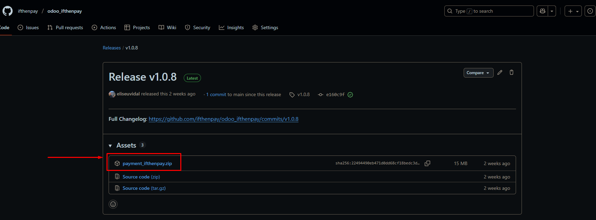
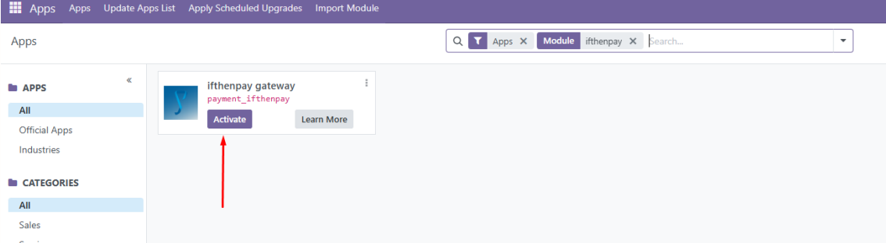
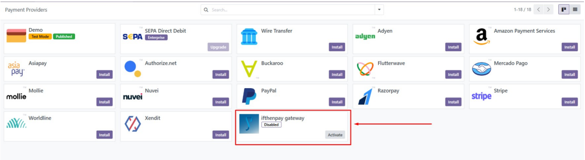
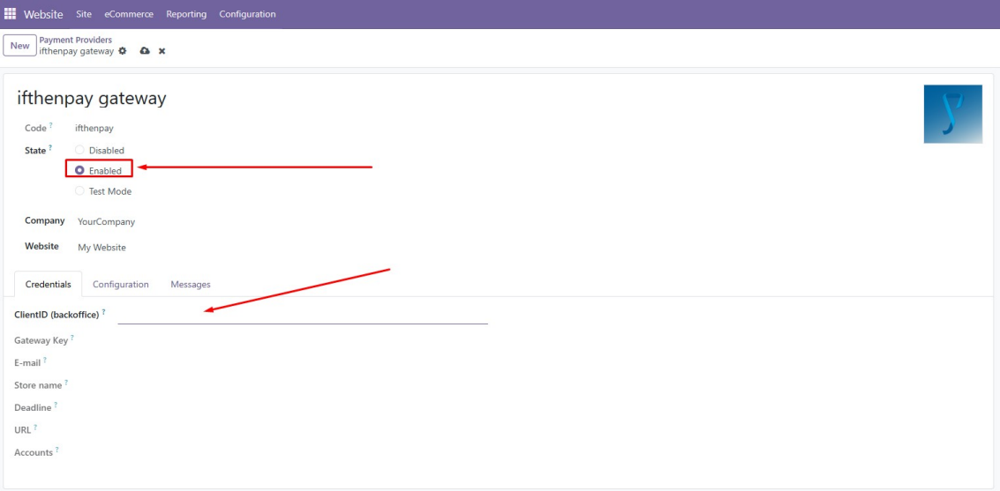
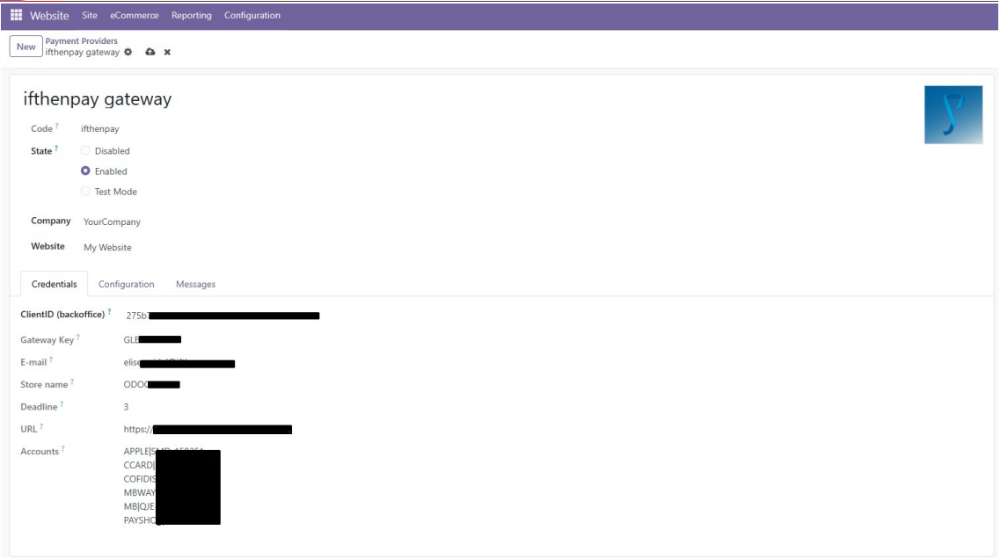

# 📘 User Guide

Read in  [Portuguese](README_PT.md) or  [English](README.md)

### 📌 Table of Contents

1. [Introduction 🚀](#1-introduction-)
2. [Connection 🔗](#2-connect-odoo-store-to-ifthenpay-account-)
3. [Installation 📥](#3-installation-)

---

### 📖 Introduction  
This document aims to guide Odoo merchants through the installation process of the ifthenpay Addons using the local server distribution method (On-Premise) for version 18.0.

The extension was developed to customize the checkout experience in Odoo stores, allowing all payment methods offered by ifthenpay to be available. To start the integration, you should contact the ifthenpay Helpdesk, which will provide the necessary access.

📩 suporte@ifthenpay.com  

---

### 🔗 Connect Odoo Store to ifthenpay Account  
To establish the connection between an Odoo store and an ifthenpay account, you should contact the ifthenpay team to create the gateway to be used in the Odoo context.

1. Log in to the ifthenpay backoffice.  
2. Go to **Administration → Integrations → New Credential**.  
3. Select the **Odoo** platform.  
4. Click the gear icon (⚙️) on the new record generated, which will open the Odoo integration form.  
5. Fill in the Odoo store details, including the store URL, email address, and store name.  
6. In the next tab, select the gateway created for the Odoo context and choose the desired payment methods for the store. You can also set a preferred payment method and indicate the payment link duration (in days).  

---

### ⚙️ Installation  
1. Download the file `payment_ifthenpay.zip`.  

2. Extract the downloaded file and add the Addon to your Odoo server in the location:  or in your local `custom_addons` folder.  
3. After this, restart your Odoo server.  

- Once the module is added to the “addons” directory of your project, it should appear among Odoo apps. Go to the “apps” page → “update app list” → search for “ifthenpay” and press “Enter”.

- You should now see the ifthenpay module. Just click “Activate”.

- Next, go to the payment provider settings.

- On this page, ifthenpay should appear as an installed option available for configuration. Click it to access the settings.

- In the settings, first enable the corresponding option, then enter your **backoffice key** in the (ClientID) field; click outside the field to confirm.

- After this step, the remaining fields will be automatically filled with the information configured in the ifthenpay backoffice, and the module will be ready to use.

