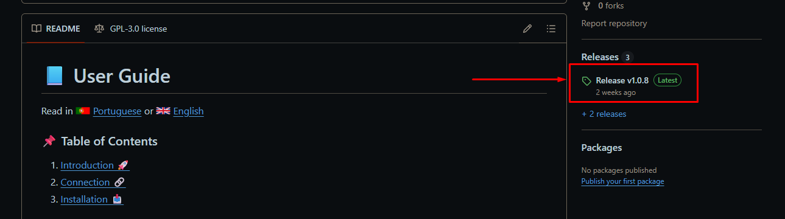
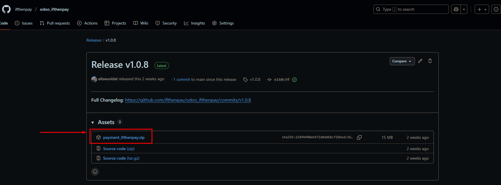
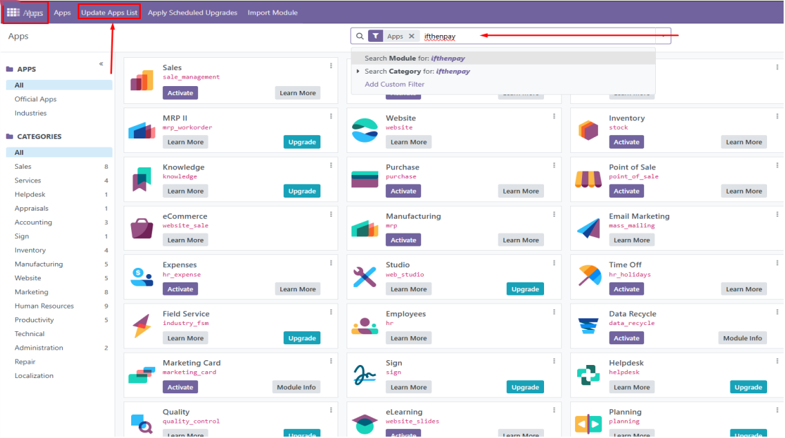
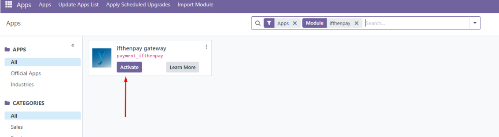
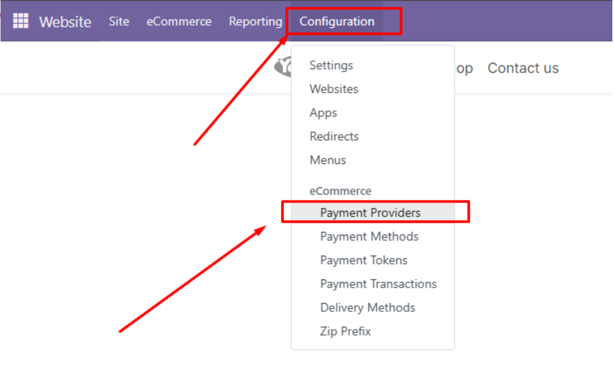
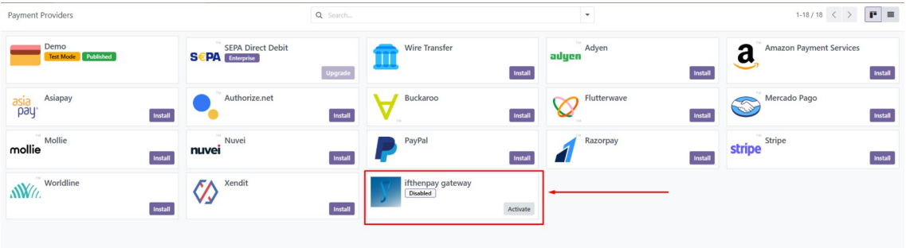
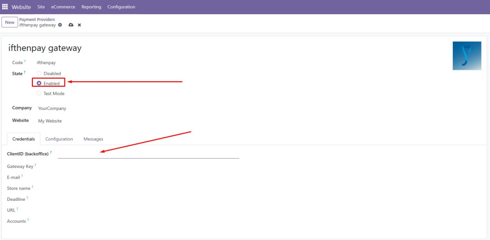
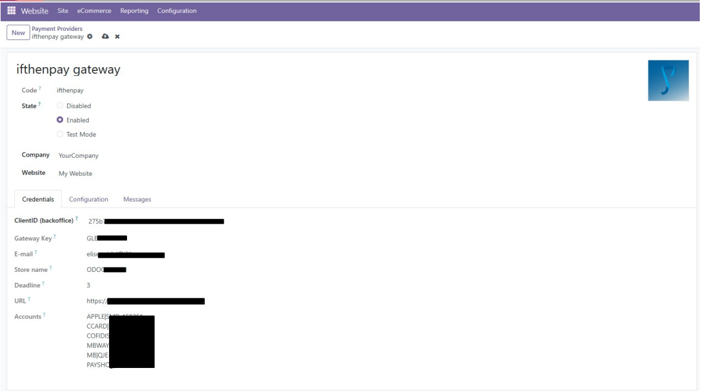

# 📘 Guia do Utilizador

Leia em  [Portuguese](README_PT.md) ou  [English](README.md)

### 📌 Índice

1. [Introdução 🚀](#1-introdução-)
2. [Conexão 🔗](#2-conectar-loja-odoo-a-conta-ifthenpay-)
3. [Instalação 📥](#3-installation-)

---

### 📖 Introdução  
O presente documento tem como objetivo orientar os comerciantes Odoo no processo de
instalação da ifthenpay Addons utilizando o método de distribuição em servidor local (On
Premise) para a versão 18.0.

A extensão foi desenvolvida para personalizar a experiência de checkout em lojas Odoo,
permetindo disponibilizar todos os métodos de pagamento oferecidos pela ifthenpay. Para
iniciar a integração, deverá entrar em contacto com o Helpdesk da ifthenpay, que fornecerá os acessos necessários para o efeito.

📩 suporte@ifthenpay.com  

---

### 🔗 Conectar Loja Odoo à conta ifthenpay  
Para estabelecer a ligação entre uma loja Odoo e a conta ifthenpay, deverá contactar a equipa
da ifthenpay, a fim de que seja criada a respetiva gateway a utilizar no contexto Odoo.

1. Inicie sessão no backoffice da ifthenpay. 
2. Vá a **Administração → Integrações → Nova Credencial**.  
3. Selecione a plataforma **Odoo**.
4. Clique no ícone de roda dentada (⚙️) no novo registo gerado, que abrirá o formulário de integração do Odoo.
5. Preencha os dados da loja Odoo, incluindo o URL da loja, o endereço de e-mail, e o nome da loja. 
6. No separador seguinte, selecione a gateway gerada para o contexto Odoo e escolha os
métodos de pagamento pretendidos para a loja. Pode ainda definir um método de
pagamento preferencial e indicar a duração do link de pagamento (em dias).

---

### ⚙️ Instalação  
1. Descarregue o arquivo `payment_ifthenpay.zip`.  




2. Descompacte o arquivo baixado e adicione o Addon ao seu servidor odoo no local  
   ```
   Odoo_18.0/server/odoo/addons
   ```
   ou no `custom_addons` local.  
3. Após isso, reinicie seu servidor odoo.  

- Após adicionar o módulo ao diretório “addons” do seu projeto, este deverá surgir entre as aplicações do Odoo. Aceda à página de “apps” → “atualize a lista de apps” → pesquise por “ifthenpay” e pressione “Enter”.



- Agora você deverá visualizar o módulo do ifthenpay, basta clicar em “Ativar”.



- De seguida, aceda às definições dos fornecedores de pagamento.



- Nesta página, a ifthenpay deverá surgir como opção instalada e disponível para configuração,
clique nela para aceder às definições



- Nas definições, deverá primeiro ativar a opção correspondente e, em seguida, indicar a sua
**chave backoffice** no campo (ClientID); depois, clique fora do campo para confirmar.



- Após este passo, os restantes campos serão preenchidos automaticamente com as informações
configuradas no backoffice da ifthenpay, ficando o módulo pronto para utilização.


